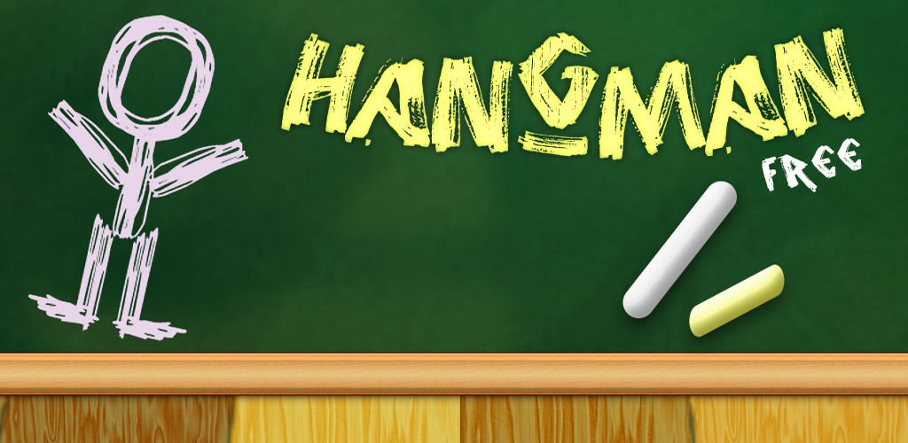
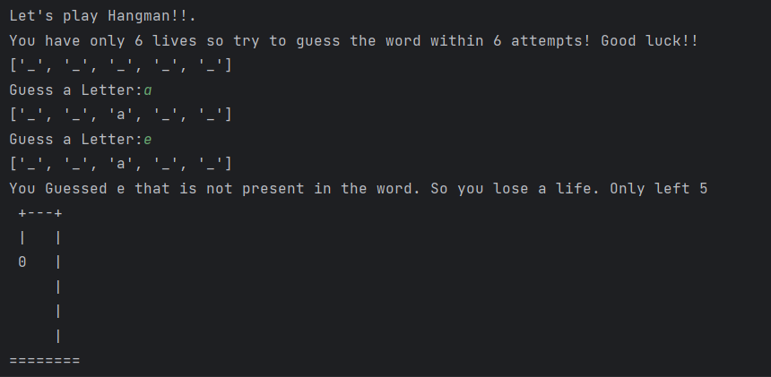
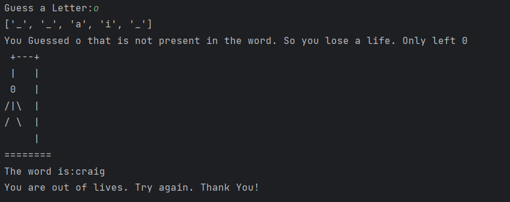

# **First Project**

This is my first project with git.

# _Let's play Hangman!!_


Following is a Python script of the classic game “Hangman”. A row of dashes represents the word to guess. If the player guesses a letter in the word, the script writes it in all its correct positions.  The player has 6 turns to guess the word. You can easily customize the game by changing the variables.

## Instructions

1. Open index.html in your browser to get an idea of Hangman game.



* You can code your own hangman game to play with you friends.
1. 

* Download the dictionary file and open file for reading. 
---
```python
import random


def load_words_from_file(file_path):
    with open(file_path, "r") as file:
        words = [line.strip() for line in file]
    return words
```
* Generate random word from the dictionary
```python
def generate_random_word(word_list):
    return random.choice(word_list)


# Specify the path to your dictionary file
dictionary_file_path = "dictionary.txt"
# Load words from the dictionary file
word_list = load_words_from_file(dictionary_file_path)
random_word = generate_random_word(word_list)
```
* Rest of the part

```python
word = []
print("Let's play Hangman!!. \nYou have only 6 lives so try to guess the word within 6 attempts! Good luck!!")
for i in range(len(random_word)):
    word += "_"
print(word)

life = 6
index = -1
while life < 7:
    guess = input("Guess a Letter:")
    for letter in random_word:
        index += 1
        if guess == letter:
            word[index] = guess
        else:
            pass
    else:
        print(word)
        
    index = -1
    if guess not in word:
        life += (-1)
        print(f"You Guessed {guess} that is not present in the word. So you lose a life. Only left {life}")
        if life == 5:
            print(" +---+\n |   |\n 0   |\n     |\n     |\n     |\n========")
        elif life == 4:
            print(" +---+\n |   |\n 0   |\n |   |\n     |\n     |\n========")
        elif life == 3:
            print(" +---+\n |   |\n 0   |\n/|   |\n     |\n     |\n========")
        elif life == 2:
            print(" +---+\n |   |\n 0   |\n/|\  |\n     |\n     |\n========")
        elif life == 1:
            print(" +---+\n |   |\n 0   |\n/|\  |\n/    |\n     |\n========")
        else:
            print(" +---+\n |   |\n 0   |\n/|\  |\n/ \  |\n     |\n========")
            print(f"The word is:{random_word}")
            print("You are out of lives. Try again. Thank You!")

            break

    if word.count("_") == 0:
        print("You Win!")
        print(f"Tou have correctly guess the {random_word}")
        break
```
[Hangman python code](https://github.com/Sachanee/My-first-project/blob/main/hangman.py)

* Now you can run your own Hangman game!!.


# Outputs



